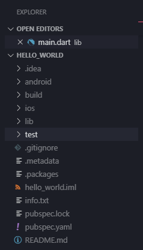
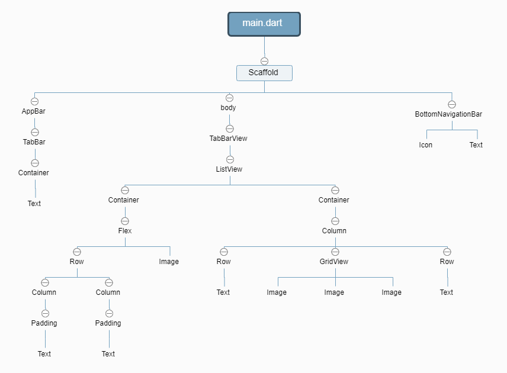

# Flutter 从入门到实战头条 APP

## 一、背景&介绍

Flutter 作为 Google 大力推出的一种全新的响应式，跨平台，高性能的移动开发框架。旨在帮助开发者使用一套代码开发高性能、高保真的 Android 和 iOS 应用。

flutter 优点主要包括：

- 跨平台性能更好，兼容性更好
- 流畅、开源、Hot Reload
- 响应式视图的优点，不需要 JavaScript 的桥接器
- 其丰富美观的控件以及开发工具 UI
- 跨平台稳定/灵活的界面设计以及控件组合，借助可以移植的 GPU 加速的渲染引擎以及高性能 ARM 代码运行时已达到高质量的用户体验

看了下官网的基础教程后我决定直接上手做一个 App，一是这样学的比较快、印象更加深刻，二是可以记录其中遇到的一些坑，帮助大家少走一些弯路。

## 二、目的

本篇主要分为： 环境搭建、基础控件布局、数据交互模块、其他插件使用 四部分。每大块中的小模块，除了涉及的功能实现外，对于实现过程中遇到的问题，会展开描述。<br>
本次分享的最终目的是做出一个基础的 APP 例子这样学的比较快印象更加深刻，分享其中遇到的一些坑，帮助大家少走一些弯路.

## 三、内容

### 1、环境搭建

1、 安装 java 环境

- 官网下载地址：jdk 下载地址：[JDK 8.0 64 位下载](https://www.oracle.com/technetwork/java/javase/downloads/jdk8-downloads-2133151.html)
- JDK 环境变量配置 - win：[JDK 环境变量配置 - win](https://www.jianshu.com/p/13df433d3687)

2、 Android Studio

- 也可以不下载，前端开发，一直使用的是 VS Code，所以就没有安装，直接下载的 Android SDK。
- 官网下载地址：[Android Studio 下载](https://developer.android.com/)

3、下载 Android SDK

- 下载好了 Android Studio 的可以不用下载这个（一般内含 SDK）。
- 官网下载（科学上网）：[Android SDK](https://developer.android.com/studio/index.html)
- 不需要翻墙下载地址：[Android SDK](http://www.androiddevtools.cn/)
- [Android SDK win 环境变量配置及 SDK 说明](https://flutterchina.club/setup-windows/#android%E8%AE%BE%E7%BD%AE)

4、下载 Flutter SDK

- 官网下载：[Flutter SDK](https://flutter.io/sdk-archive/#windows)
- [Flutter SDK win 环境变量配置](https://flutterchina.club/setup-windows/#%E8%8E%B7%E5%8F%96flutter-sdk)

[在 Windows 上搭建 Flutter 开发环境](https://flutterchina.club/setup-windows/)

#### 初始项目目录结构



### 2、基础控件布局




##### [Tabbar 控件](https://book.flutterchina.club/chapter5/material_scaffold.html)

Tabbar 页面是常有需求，而在 Flutter 中： Scaffold + AppBar + Tabbar + TabbarView 是 Tabbar 页面的最简单实现。

```dart
child:new Scaffold(
  appBar: new AppBar(
    elevation: 0.0,//导航栏下面那根线
    title: new TabBar(
      isScrollable: false,//是否可滑动
      unselectedLabelColor: Colors.black26,//未选中按钮颜色
      labelColor: Colors.black,//选中按钮颜色
      labelStyle: TextStyle(fontSize: 18),//文字样式
      indicatorSize: TabBarIndicatorSize.label,//滑动的宽度是根据内容来适应,还是与整块那么大(label 表示根据内容来适应)
      indicatorWeight: 4.0,//滑块高度
      indicatorColor: Colors.yellow,//滑动颜色
      indicatorPadding: EdgeInsets.only(bottom: 1),//与底部距离为 1
      tabs: titleList.map((String text) {//tabs 表示具体的内容,是一个数组
        return new Tab(
          text: text,
        );
      }).toList(),
    ),
  ),
  //body 表示具体展示 TabBarView 的内容
  body:\_tabBarView() ,
)
```

##### [ListView](https://book.flutterchina.club/chapter6/listview.html)

ListView 是最常用的滚条列表。

```dart
child:new ListView.separated(
  itemCount: iconItems.length,//加载条数
  itemBuilder: (context, item) {//列表 UI
    return buildListData(context, titleItems[item], iconItems[item], subTitleItems[item]);
  },
  separatorBuilder: (BuildContext context, int index) => new Divider(),//分割线
)
```

##### [Container](https://book.flutterchina.club/chapter5/constrainedbox_and_sizebox.html)

Container的布局可以做出很复杂的样式、平时使用最多的，也就是padding、color、width、height、margin属性。


```dart
new Container(
         alignment: Alignment.center,//文字对齐
         padding: const EdgeInsets.all(15.0),//内边距
         margin: const EdgeInsets.all(15.0),//外边距
         height:300,
         width:300,
         decoration: new BoxDecoration(//修饰
           border: new Border.all(//边框
             color: Colors.red,
           ),
           image: const DecorationImage(//背景图片设置
             image: const NetworkImage(
               'https://gw.alicdn.com/tfs/TB1CgtkJeuSBuNjy1XcXXcYjFXa-906-520.png',
             ),
             fit: BoxFit.contain,
           ),
           //borderRadius: const BorderRadius.all(const Radius.circular(6.0)),
           borderRadius: const BorderRadius.only(//圆角边框
             topLeft: const Radius.circular(3.0),
             topRight: const Radius.circular(6.0),
             bottomLeft: const Radius.circular(9.0),
             bottomRight: const Radius.circular(0.0),
           ),
         ),
         child: new Stack(children: <Widget>[//层级设置，第一个在最高层
              new Container(//最上层
                color: Colors.blueAccent,
                height: 50.0,
                width: 100.0,
                alignment: Alignment.center,
                child: Text('unPositioned'),
              ),
              new Positioned(
                  left: 40.0,
                  top: 80.0,
                  child: new Container(
                    color: Colors.pink,
                    height: 50.0,
                    width: 95.0,
                    alignment: Alignment.center,
                    child: Text('Positioned',
                       style: TextStyle(//文字样式
                       color: Colors.grey
                      )
                    ),
                  )),
            ])),
       ),
```
##### [事件处理](https://book.flutterchina.club/chapter8/)

Flutter中的手势系统有两个独立的层。第一层为原始指针(pointer)事件，它描述了屏幕上指针（例如，触摸、鼠标和触控笔）的位置和移动。 
第二层为手势，描述由一个或多个指针移动组成的语义动作，如拖动、缩放、双击等。

```dart
    //原始指针事件
    Listener(
      child: Container(//监听的组件
        alignment: Alignment.center,
        color: Colors.blue,
        width: 300.0,
        height: 150.0,
        child: Text(_event?.toString()??"",style: TextStyle(color: Colors.white)),
      ),
      onPointerDown: (PointerDownEvent event) => setState(()=>_event=event),//手指按下回调
      onPointerMove: (PointerMoveEvent event) => setState(()=>_event=event),//手指移动回调
      onPointerUp: (PointerUpEvent event) => setState(()=>_event=event),//手指抬起回调
    ),

    //手势事件
    Center(
      child: GestureDetector(
        child: Container(
          alignment: Alignment.center,
          color: Colors.blue,
          width: 200.0, 
          height: 100.0,
          child: Text(_operation,
            style: TextStyle(color: Colors.white),
          ),
        ),
        onTap: () => updateText("Tap"),//点击
        onDoubleTap: () => updateText("DoubleTap"), //双击
        onLongPress: () => updateText("LongPress"), //长按
        //手指按下时会触发此回调
        onPanDown: (DragDownDetails e) {
          //打印手指按下的位置(相对于屏幕)
          print("用户手指按下：${e.globalPosition}");
        },
        //手指滑动时会触发此回调
        onPanUpdate: (DragUpdateDetails e) {
          //用户手指滑动时，更新偏移，重新构建
          print(e.delta.dx);
          print(e.delta.dy);
        },
        onPanEnd: (DragEndDetails e){
          //打印滑动结束时在x、y轴上的速度
          print(e.velocity);
        },
      ),
```


### 3、数据交互模块
##### [dio网络请求](https://github.com/flutterchina/dio)
Dio是Flutter中文网开源的一个强大的Dart Http请求库，支持Restful API、FormData、拦截器、请求取消、Cookie管理、文件上传/下载、超时等。

```dart
   postRequest() async {
    var path = "https://www.dftoutiao.com/user/register";
    var params = {
      "username": "aa112233",
      "password": "123456",
      "repassword": "123456"
    };
    //get 请求
    //Response response = await Dio().post(path);
    //post请求
    Response response = await Dio().post(path, queryParameters: params);
    this.setState(() {
      result= json.decode(response.toString());
    });
  }
```
##### [fluro路由框架](https://github.com/theyakka/fluro)
fluro简化了Flutter的路由开发，也是目前Flutter生态中最成熟的路由框架。handler相当于一个路由的规则，每添加一个路由，router文件和Handler文件都要进行配置。
```dart
//整体配置
    var detailsHandler = Handler(handlerFunc: (BuildContext context, Map<String, dynamic> params) {
          return SwiperDiy();
    });
    
    router.define('/detail', handler: detailsHandler); //Handler设置别名加入路由
    
    Widget build(BuildContext context) {
        //-------------------主要代码start
        final router = Router(); //路由初始化
        Routes.configureRoutes(router);
        Application.router = router;
        //-------------------主要代码end

        return Container(
          child: MaterialApp(
            title:'百姓生活+',
            debugShowCheckedModeBanner: false,
            //----------------主要代码start
            onGenerateRoute: Application.router.generator, //路由静态化
            //----------------主要代码end
            theme: ThemeData(
              primaryColor:Colors.pink,
            ),
            home:IndexPage()
          ),
        );
    }
    Application.router.navigateTo(context,"/detail?id=${val['goodsId']}");//进行跳转
```

##### [Provider状态管理](https://github.com/rrousselGit/provider)
Provider将共享状态放到顶层MaterialApp之上。底层部件通过Provier获取该状态，并通过混合ChangeNotifier通知依赖于该状态的组件刷新。
```dart
    class Counter with ChangeNotifier{
      int value = 0;

      increment(){
        value++;//修改值
        notifyListeners();//通知widget改变状态
      }
    }
    var counter = Counter();
    var providers = Providers();

    //将counter对象添加进providers
    providers.provide(Provider<Counter>.value(counter));
    
    //最上层添加providers
    runApp(ChangeNotifierProvider<Counter>.value(
        notifier: Counter(1),
        child: MyApp(),
    ));
    
    //获取值
    final currentCounter = Provide.value<Counter>(context);
    
```
##### [Json转Dart Model类](https://book.flutterchina.club/chapter11/json_model.html)

由于接口返回的数据就是JSON格式的字符串直接json.decode()转为Dart对象，这意味着直到运行时我们才知道值的类型。 <br>
通过这种方法，我们失去了大部分静态类型语言特性：类型安全、自动补全和最重要的编译时异常，这样一来，我们的代码可能会变得非常容易出错。<br>
所以需要通过预定义一些与Json结构对应的Model类，然后在请求到数据后再动态根据数据创建出Model类的实例。

```dart
    //User.dart
    class User {
      final String name;
      final String email;

      User(this.name, this.email);

      User.fromJson(Map<String, dynamic> json)
          : name = json['name'],
            email = json['email'];

      Map<String, dynamic> toJson() =>
        <String, dynamic>{
          'name': name,
          'email': email,
        };
    }
    
    //使用
    Map userMap = json.decode(json);
    var user = new User.fromJson(userMap);

    print('Howdy, ${user.name}!');
    
    
```
实际场景中，JSON对象很少会这么简单，多层嵌套的JSON对象并不罕见，<br>
所以我们需要json_serializable 自动生成Model类，序列化代码不再由我们手写和维护，将运行时产生JSON序列化异常的风险降至最低。<br>
在这个网站将json字符串运行生成Model类：[Json转Model类](https://caijinglong.github.io/json2dart/index.html)
```dart
   //显式关联JSON字段名与Model属性的对应关系 
        @JsonKey(name: 'registration_date_millis')
        final int registrationDateMillis;
```
终端输入：flutter packages pub run build_runner build  <br>
相应的文件下会自动生成一个User.g.dart文件
    
### 4、其他插件使用

- [Flutter 常用工具类库](https://github.com/Sky24n/flustars)
- [WebView 插件](https://github.com/flutter/plugins/tree/master/packages/webview_flutter)
- [siwiper 无限轮播](https://github.com/best-flutter/flutter_swiper)
- [下拉刷新/上拉加载](https://github.com/xuelongqy/flutter_easyrefresh)
- [极光推送](https://github.com/jpush/jpush-flutter-plugin)


## 总结&结论

2019 年的全球开发者问卷调查中，Flutter 被选为最受开发者欢迎的框架之一，超过了 TensorFlow 和 Node.js。<br>
最新版本已支持[Web](https://mp.weixin.qq.com/s?__biz=MzAwODY4OTk2Mg==&mid=2652048000&idx=1&sn=2f546834b19bbc44bc6c966cea596971&chksm=808caac5b7fb23d322c72150bb26f604fb0b1f554c6abaea2fae6a6bafdb94222ea29bd0867c&scene=21#wechat_redirect)、桌面端和嵌入式系统的[实例](https://mp.weixin.qq.com/s?__biz=MzAwODY4OTk2Mg==&mid=2652049217&idx=1&sn=25e9d691572b24fd228433a146acb405&chksm=808caf04b7fb26129847c9cefa5f7ab39c3dfe0b695baa44cb0c2dc5a9249a999683816d7363&scene=21#wechat_redirect)，长期目标是让 Flutter 在所有带屏幕的设备上都可以实现优秀的用户体验<br>——甚至包括充满创意的大型互动装置。

Flutter 的各种 UI 库和组件都在不断增加，与之相关的各种生态系统和社区也在不断完善，<br>它对新的操作系统的适配性将会越来越强。相信在不久的将来，Flutter 会慢慢成熟起来，成为主流的开发语言之一。<br>


## 其他

- [Flutter 中文文档](https://flutterchina.club/docs/)
- [Flutter 实战](https://book.flutterchina.club/)
- [Dart 文档](http://www.dartdoc.cn/samples/)
- [阿里 Flutter go 组件 demo](https://github.com/alibaba/flutter-go)
- [Flutter 高仿知乎 UI](https://github.com/xujiyou/zhihu-flutter)
- [Flutter 掘金社区](https://juejin.im/tag/Flutter?utm_source=flutterchina&utm_medium=word&utm_content=btn&utm_campaign=q3_website)
- [Dart 语言和 Flutter 基础](https://juejin.im/post/5b631d326fb9a04fce524db2)
